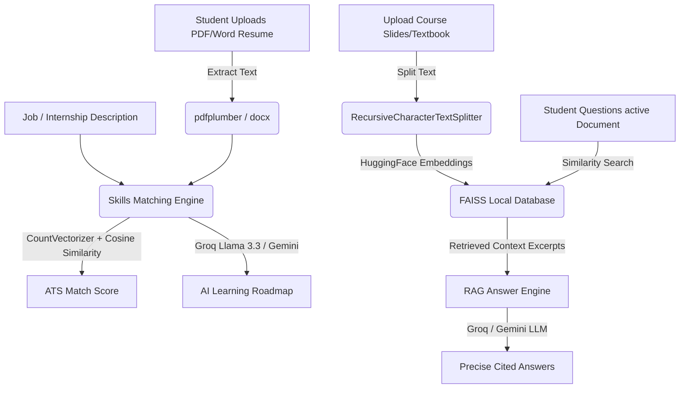

# LastMinute.AI 🎓🤖

### **Unified Student Learning Portal & AI-Powered Career Readiness System**

Welcome to **LastMinute.AI**, a premium, state-of-the-art Single Page Application (SPA) designed to supercharge student learning, document comprehension, exam preparation, and career readiness. It provides a cohesive, high-fidelity dark glassmorphic interface that integrates five distinct educational tools under a single dashboard:

1.  **ATS Resume Scanner & Skill Gap Detector** (Cosine Similarity + CountVectorizer matching)
2.  **RAG Document QA** (Context-aware search using local FAISS Vector Databases)
3.  **Personalized Study Scheduler** (Week-by-week planner)
4.  **Practice Assessments & 3D Flashcards** (Interactive MCQ grading & flipping study decks)
5.  **AI Academic Tutor** (Conversational assistant with Llama 3.3 Flagship)

Additionally, this workspace contains **four standalone sub-projects** for modular execution and submission.

---

## 📖 Table of Contents

1. [Core Features & Architecture](#-core-features--architecture)
2. [Technology Stack](#-technology-stack)
3. [Project Directory Layout](#-project-directory-layout)
4. [Detailed API Configuration](#-detailed-api-configuration)
5. [Setup & Installation Guide](#-setup--installation-guide)
6. [Running the Application](#-running-the-application)
7. [Unified Dashboard Interface Guide](#-unified-dashboard-interface-guide)
8. [Standalone Sub-Projects Details](#-standalone-sub-projects-details)
9. [Troubleshooting & FAQs](#-troubleshooting--faqs)

---

## 🌟 Core Features & Architecture



### 1. AI Resume Scorer & Skill Gap Detector

- **Text Extraction**: Leverages `pdfplumber` and `docx` to cleanly parse formatted resumes.
- **Skill matching**: Matches words using a word-boundary regular expression pattern (`\b`) against a pre-compiled dictionary of academic and technology terms in `skills_db.py`.
- **ATS Similarity Metric**: Utilizes `CountVectorizer` to vectorize the resume and job description texts, computing a similarity rating using `cosine_similarity`.
- **AI Recommendations**: Sends the matched and missing skills to the LLM to write a comprehensive learning roadmap detailing project ideas and study platforms.

### 2. Retrieval-Augmented Generation (RAG Document QA)

- **Text Chunking**: Splits large PDFs, Word documents, or text files into `1000` character chunks with a `200` character overlap using LangChain's `RecursiveCharacterTextSplitter`.
- **Vector Database**: Embeds chunks using LangChain's `HuggingFaceEmbeddings` (running the `sentence-transformers/all-MiniLM-L6-v2` model) and saves them locally in a FAISS index directory.
- **Context Extraction**: Performs similarity search on user questions, extracting the top `4` relevant context passages.
- **Synthesis**: Prompts the LLM with the context to answer the question, instructing it to strictly cite details from the uploaded material.

### 3. Personalized Study Planner

- Collects the target goal, duration (weeks), weekly time commitment, and current skill level.
- Generates week-by-week study planners, suggesting hours to spend on subtopics, coding tasks, and resource recommendations.
- Features a dashboard integration that pins the generated plans as active target goals with progress bars.

### 4. Interactive Practice Assessments

- **MCQ Quiz**: Auto-generates multiple-choice questions on any subject. Grades answers in real-time, displaying animated success/danger checkmarks and detailed explanations of concepts.
- **3D Flipping Flashcards**: Generates a card deck of key concepts. Cards flip in 3D when clicked, revealing definitions and explanations.

### 5. AI Academic Tutor Chatbot

- A general conversation window equipped with quick-start chips (Big O notation, Binary Search, Mitochondria ATP) to get instant help with homework, programming, or science topics.

---

## 🛠️ Technology Stack

- **Backend Core**: Python 3.12, Flask, Flask-CORS, python-dotenv
- **Vector Database**: `faiss-cpu` (Facebook AI Similarity Search)
- **Orchestration**: LangChain, `langchain-community`, `langchain-text-splitters`
- **Embeddings Model**: `sentence-transformers` (`all-MiniLM-L6-v2` - 384 dimensions)
- **File Extraction**: `pypdf`, `pdfplumber`, `python-docx`
- **Mathematical Metrics**: `scikit-learn` (CountVectorizer, cosine_similarity)
- **LLM Providers**:
  - **Groq API**: Defaults to `llama-3.3-70b-versatile` (extremely fast, structured outputs), with automatic fallback to `llama-3.1-8b-instant` if rate limits are reached.
  - **Google Gemini API**: Uses `gemini-1.5-flash` via `google-generativeai`.
- **Frontend Assets**: Vanilla HTML5, Vanilla CSS3 (custom CSS custom variables, dark theme gradients, floating animated blobs, glassmorphic layout), Vanilla ES6 JavaScript (Marked.js, Lucide Icons).

---

## 📁 Project Directory Layout

```
C:\Users\VENKATA PAVANI\Desktop\LastMinuteAI
|-- app.py                     # Unified Portal Flask Server (Port 5000)
|-- requirements.txt           # Main dependencies configuration
|-- skills_db.py               # Pre-compiled database of tech & academic skills
|-- .env                       # Local Environment configuration (API keys)
|
|-- templates/                 # Unified UI Templates
|   |-- index.html             # High-fidelity dashboard interface
|-- static/                    # Unified UI Static Assets
|   |-- css/style.css          # Glassmorphic dark stylesheets & blob animations
|   |-- js/app.js              # Client SPA controller & state coordinator
|
|-- utils/                     # Unified Portal Backend Utilities
|   |-- __init__.py            # Package Init
|   |-- docx_reader.py         # Parses MS Word DOCX files
|   |-- pdf_reader.py          # Parses PDF files using PyPDF
|   |-- vector_store.py        # Splits and indexes texts using LangChain & FAISS
|   |-- rag_chat.py            # Formulates prompt context and requests RAG responses
|   |-- quiz_generator.py      # Formulates MCQs using LLM structured JSON
|   |-- flashcard_generator.py # Formulates Flashcards using LLM structured JSON
|   |-- summary_generator.py   # Formulates Document summary
|   |-- study_plan.py          # Formulates personalized study schedules
|
|-- AI_Resume_Analyser/        # 1. Standalone Resume Scorer (Port 5001)
|   |-- app.py                 # Standalone Resume Matcher Flask Server
|   |-- skills.py              # Skill list database
|   |-- requirements.txt       # Dependencies
|   |-- .env                   # Local credentials key
|   |-- static/style.css       # Standalone stylesheet
|   |-- templates/index.html   # Standalone HTML structure
|
|-- Chatbot_LLM/               # 2. Standalone Chatbot Tutor (Port 5002)
|   |-- app.py                 # Standalone LLM Chat Flask Server
|   |-- requirements.txt       # Dependencies
|   |-- .env                   # Local credentials key
|   |-- static/style.css       # Standalone stylesheet
|   |-- templates/index.html   # Standalone Chat UI
|
|-- Personalized_study_assistent/ # 3. Standalone Study Planner (Port 5003)
|   |-- app.py                 # Standalone Study Planner & Quiz Flask Server
|   |-- requirements.txt       # Dependencies
|   |-- .env                   # Local credentials key
|   |-- static/style.css       # Standalone stylesheet
|   |-- templates/index.html   # Standalone Planner & Quiz UI
|
|-- Rag_Document_answering/    # 4. Standalone Document QA / RAG (Port 5004)
|   |-- app.py                 # Standalone RAG Search Flask Server
|   |-- requirements.txt       # Dependencies
|   |-- .env                   # Local credentials key
|   |-- static/style.css       # Standalone stylesheet
|   |-- templates/index.html   # Standalone Document RAG UI
|   |-- utils/                 # Standalone RAG vector store and parsers
```

---

## 🔑 Detailed API Configuration

LastMinute.AI is model-agnostic and dynamically adapts to either **Groq** or **Google Gemini** credentials.

### How to configure keys:

1.  **Via Settings Panel**: Navigate to the Settings tab in the sidebar of the running application. Choose your provider, paste your key, and click **Save API Key**. This writes the credentials to your local `.env` and activates it in the running session immediately.
2.  **Manual env Setup**: Create or edit the `.env` file in the root directory:
    - _To use Groq_: Add `GROQ_API_KEY=your_gsk_key_here`
    - _To use Gemini_: Add `GEMINI_API_KEY=your_aiza_key_here`

---

## ⚙️ Setup & Installation Guide

### 1. Install Python

Ensure **Python 3.12+** is installed on your operating system. Check this by executing:

```bash
python --version
```

### 2. Clone/Open Project

Open your terminal in the workspace directory:

```bash
cd "C:\Users\VENKATA PAVANI\Desktop\LastMinuteAI"
```

### 3. Setup Virtual Environment (Recommended)

Create and activate a virtual environment to manage dependencies locally:

```bash
# Windows (PowerShell)
python -m venv venv
.\venv\Scripts\Activate.ps1

# macOS/Linux
python3 -m venv venv
source venv/bin/activate
```

### 4. Install Dependencies

Run the installation script to fetch all required libraries:

```bash
pip install -r requirements.txt
```

---

## 🚀 Running the Application

### Option A: Run the Unified Web Portal (Recommended)

This launches the complete suite under the premium glassmorphic single-page dashboard:

```bash
python app.py
```

Open your browser and navigate to: **[http://127.0.0.1:5000/](http://127.0.0.1:5000/)**

### Option B: Run Standalone Sub-Projects

You can run any of the standalone modules individually on their assigned ports:

1.  **AI Resume Analyser (Port 5001)**:
    ```bash
    cd AI_Resume_Analyser
    python app.py
    ```
    Access on: **`http://127.0.0.1:5001/`**
2.  **Chatbot LLM (Port 5002)**:
    ```bash
    cd Chatbot_LLM
    python app.py
    ```
    Access on: **`http://127.0.0.1:5002/`**
3.  **Personalized Study Assistant (Port 5003)**:
    ```bash
    cd Personalized_study_assistent
    python app.py
    ```
    Access on: **`http://127.0.0.1:5003/`**
4.  **Document QA / RAG (Port 5004)**:
    ```bash
    cd Rag_Document_answering
    python app.py
    ```
    Access on: **`http://127.0.0.1:5004/`**

---

## 🖥️ Unified Dashboard Interface Guide

- **Welcome Banner**: The landing section features a typewriter animation showcasing learning objectives and a quick-action route.
- **ATS Score Gauges**: Displays a circular SVG progress gauge showing your match percentage rating. It uses green for excellent matches, orange for potential matches, and red for suboptimal matches.
- **Drag-and-Drop Zones**: Features interactive upload containers that scale up and highlight with neon borders when hovering/dragging files over them.
- **VS Code Code Wrapper**: Code blocks generated in chat or study guides feature a syntax-header stating the programming language, along with a functional copy button.
- **Slide transitions**: MCQ grading transitions slide questions out smoothly for a premium, mobile-like feel.

---

## 📦 Standalone Sub-Projects Details

Each standalone module is completely self-contained. They possess separate `static/` files and their own `.env` configuration file so that they can be submitted or graded independently:

- **AI_Resume_Analyser**: Integrates `pdfplumber` and `CountVectorizer` to score ATS matches and report skill gaps. Features a clean, simple, standalone layout.
- **Chatbot_LLM**: Standard LLM tutoring chatbot that handles local history arrays and renders clean markdown formatting.
- **Personalized_study_assistent**: Features a tabbed interface separating study planners from self-assessment quiz widgets and flipping cards.
- **Rag_Document_answering**: Implements the document uploader, text chunking, FAISS database creation, similarity search, and RAG context compilation under a simplified screen.

---

## ❓ Troubleshooting & FAQs

#### Q: The application takes a few seconds to start up or index the first document. Is this normal?

**A**: Yes. On the very first run, `HuggingFaceEmbeddings` downloads the `all-MiniLM-L6-v2` model files (about 90MB) from Hugging Face and loads them into memory using PyTorch. Subsequent indexing and uploader operations run instantly.

#### Q: I get an API Key error when trying to run the chatbot or planner.

**A**: Ensure you have saved your API key under the Settings tab or added it to the `.env` file. You can generate a free Groq key at [console.groq.com](https://console.groq.com/) or a Gemini key at [aistudio.google.com](https://aistudio.google.com/).

#### Q: How do I test the RAG uploader?

**A**: Go to the **Document QA (RAG)** tab, upload any PDF or TXT textbook chapter/slides, wait for the uploader status to confirm indexing is complete, and then ask a specific question. The AI will extract relevant passages and output the answer with citation snippets!
