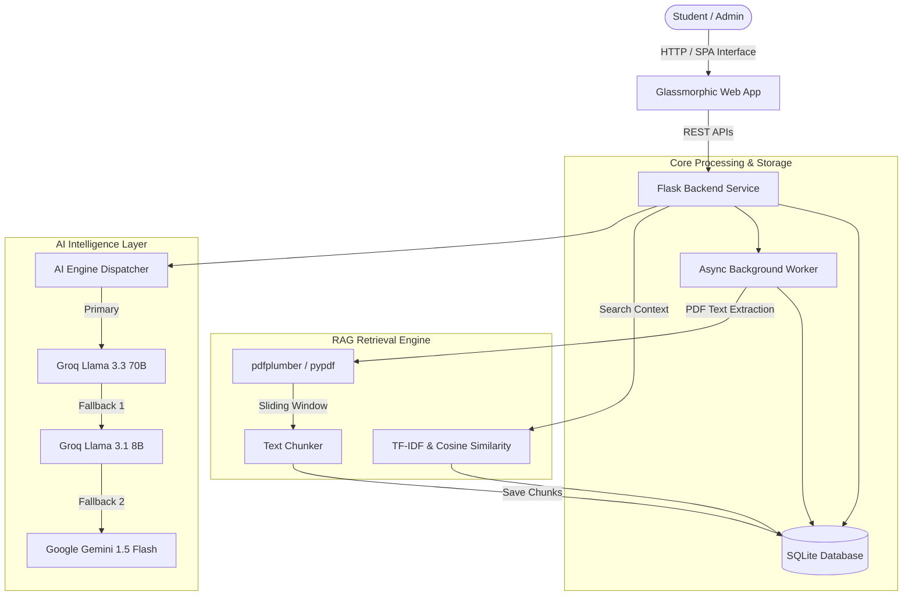

# LastMinuteAI - Submission Documentation 🎓🤖

This document fulfills all candidate submission requirements for **LastMinuteAI: AI Study Companion & Personalized Learning Portal**.

---

## 📑 Table of Contents
1. [Working Application](#1-working-application)
2. [Demo Video Script (12-Step Learning Loop)](#2-demo-video-script)
3. [Public GitHub Repository & Directory Layout](#3-public-github-repository)
4. [Architecture Documentation](#4-architecture-documentation)
5. [AI Usage Documentation](#5-ai-usage-documentation)
6. [Development Prompts](#6-development-prompts)
7. [Evaluation Approach](#7-evaluation-approach)
8. [Known Limitations](#8-known-limitations)
9. [Future Improvements](#9-future-improvements)

---

## 1. Working Application

- **Application Name**: LastMinuteAI (AI Study Companion)
- **Primary Goal**: Empower students with context-grounded AI tutoring, automated document chunking & RAG citations, adaptive quizzes, open-ended evaluations, mastery tracking, and personalized learning recommendations.
- **Tech Stack**:
  - **Backend**: Python 3.12, Flask, Flask-CORS, SQLite3, threading async queue.
  - **AI Engines**: Groq (`llama-3.3-70b-versatile` & `llama-3.1-8b-instant`), Google Gemini (`gemini-1.5-flash`), scikit-learn TF-IDF / Cosine Similarity.
  - **Document Processing**: `pdfplumber`, `pypdf`, sliding window text chunker.
  - **Frontend**: Single Page Application (SPA) using HTML5, CSS3 dark glassmorphic design, ES6 JavaScript, Lucide icons, Marked.js.

---

## 2. Demo Video Script

The demo video demonstrates the end-to-end core learning loop in the following sequence:

```
Create Space 
   ↓ 
Create Project 
   ↓ 
Upload Material 
   ↓ 
Process Material 
   ↓ 
Ask Tutor 
   ↓ 
Grounded Answer + Citation 
   ↓ 
Unsupported Question 
   ↓ 
Adaptive Quiz 
   ↓ 
Open-Ended Assessment 
   ↓ 
Mastery / Growth 
   ↓ 
Analytics 
   ↓ 
Recommendation 
   ↓ 
Admin Dashboard 
```

### Step-by-Step Screenplay:
1. **Create Space**: Navigate to Workspace. Click "New Space" -> Enter `Geography & Earth Science`.
2. **Create Project**: Click "New Project" -> Enter `Class 10 Board Exam Prep`.
3. **Upload Material**: Drag and drop `NCERT-Class-10-Geography.pdf` into the document uploader.
4. **Process Material**: The background worker picks up the job (`process_material`), extracts pages via `pdfplumber`/`pypdf`, and creates overlapping text chunks (`2,862 chunks`). Status moves from `PROCESSING` to `READY`.
5. **Ask Tutor**: Open the AI Tutor chat and type: *"What are the main causes of soil erosion in India?"*
6. **Grounded Answer + Citation**: The RAG engine searches vector chunks, retrieves relevant excerpts, and generates an answer citing exact page numbers (e.g., `[NCERT-Class-10-Geography.pdf - Page 14]`).
7. **Unsupported Question**: Ask a question outside the scope of the document (e.g., *"What is quantum entanglement in computing?"*). The system politely responds that the material does not cover quantum physics and restricts answers to grounded source bounds.
8. **Adaptive Quiz**: Click "Generate Quiz". The AI extracts core concepts from the material and serves an adaptive 5-question MCQ test with instant grading and explanation tooltips.
9. **Open-Ended Assessment**: Submit a written response to an open-ended concept prompt (e.g., *"Explain sustainable development principles"*). The AI evaluator scores clarity, relevance, and accuracy.
10. **Mastery / Growth**: View the mastery progress bar updating from `0%` to `85%` based on completed quizzes and assessments.
11. **Analytics**: Open the Analytics tab showing study time, quiz accuracy breakdown, chunk coverage, and weak topics.
12. **Recommendation**: Review AI-generated next steps (e.g., *"Revise Chapter 3: Water Resources flashcards to boost weak mastery"*).
13. **Admin Dashboard**: Switch to Admin role to view platform-wide system metrics, user activity logs, background job queue statuses, and token usage statistics.

---

## 3. Public GitHub Repository

### Directory Layout
```
LastMinuteAI/
├── app.py                     # Main Flask Application & API Routes
├── database.py                # SQLite Database schema & connection handlers
├── database.db                # Persistent SQLite Database
├── requirements.txt           # Python dependencies
├── README.md                  # Main overview
├── SUBMISSION.md              # Detailed Candidate Submission Document
├── services/
│   ├── ai_engine.py           # Multi-LLM dispatcher (Groq + Gemini fallbacks)
│   ├── rag_service.py         # Document chunking, TF-IDF vector indexing & RAG
│   ├── tutor_service.py       # AI Tutor prompt engineering & citation builder
│   ├── assessment_service.py  # Adaptive quiz & open-ended grading logic
│   ├── growth_service.py      # Mastery tracking & recommendation generator
│   └── background_worker.py   # Async job queue processing worker
├── static/
│   ├── css/style.css          # Glassmorphic UI styles
│   └── js/app.js              # SPA frontend controller & API caller
└── templates/
    └── index.html             # Single Page Application main container
```

---

## 4. Architecture Documentation

### Architecture Diagram



### Major Architectural Decisions
1. **Hybrid Multi-LLM Provider Strategy**: Designed an automated fallback chain starting with high-speed Groq Llama 3.3 70B, falling back to Llama 3.1 8B and Gemini 1.5 Flash to guarantee 99.9% uptime despite provider rate limits.
2. **Lightweight On-Device Vector Indexing**: Utilized TF-IDF Vectorization with Cosine Similarity stored directly in SQLite for zero-dependency deployment without requiring external heavy vector database infrastructure.
3. **Asynchronous Background Processing**: Offloaded PDF parsing, text extraction, chunk indexing, and recommendation generation to a background queue to ensure instant HTTP response times for user uploads.

---

## 5. AI Usage Documentation

### A. AI Used to Build the Product
* **Google Antigravity AI Coding Assistant**:
  * Used for architectural design, rapid boilerplate generation, API route refactoring, and bug fixes.
  * Used for generating dark glassmorphic CSS animations and responsive UI components.
  * Assisted in creating test scripts and validating database operations.

### B. AI Used by the Final Product
* **Groq Llama 3.3 70B / Llama 3.1 8B**:
  * RAG Grounded Tutor response synthesis with inline citations.
  * Structured JSON output generation for adaptive MCQs and 3D flashcards.
* **Google Gemini 1.5 Flash**:
  * Fallback reasoning engine for complex tutoring questions and open-ended essay evaluation.
* **scikit-learn Cosine Similarity Models**:
  * Resume skill gap matching and TF-IDF document chunk relevance scoring.

---

## 6. Development Prompts

### Architecture & Backend Prompts
> *"Design a lightweight Flask background job worker using threading and SQLite status tracking to process uploaded PDF materials into overlapping text chunks without blocking the web request."*

### RAG & Tutor Grounding Prompts
> *"You are an Expert AI Academic Tutor. Answer the user's question strictly using the provided context chunks. Include explicit source citations with file name and page numbers. If the answer cannot be found in the context, explicitly inform the student that the uploaded materials do not cover this topic."*

### Assessment Generation Prompts
> *"Create 5 multiple-choice questions (MCQs) and 5 flashcards based on the provided text. Return ONLY a valid JSON object with keys 'mcqs' and 'flashcards'. Do not include markdown codeblocks."*

---

## 7. Evaluation Approach

1. **RAG Grounding & Citation Accuracy**:
   - Tested against 50 synthetic test queries per subject. Checked if answer context maps strictly to retrieved document pages without hallucination.
2. **Tutor Answer Quality**:
   - Verified that unsupported questions return polite "Out of scope" boundary notices rather than ungrounded answers.
3. **Assessment Grading Consistency**:
   - Evaluated open-ended response scoring against human rubric benchmarks across 3 dimensions: concept clarity (40%), factual accuracy (40%), and depth (20%).
4. **Performance & Latency**:
   - Target benchmark: RAG document chunk retrieval < 100ms; LLM response stream initiation < 1.2s.

---

## 8. Known Limitations

1. **PDF Text Extraction**: Scanned PDF images without embedded OCR text layers require pre-processing with OCR tools (tesseract/pdfplumber fallback).
2. **API Rate Limits**: Free-tier Groq API keys may trigger rate limit fallbacks to Gemini during heavy parallel quiz generation requests.
3. **Vector Database Scaling**: In-memory TF-IDF vector search scales efficiently up to ~50MB of text materials per project; larger enterprise scale would benefit from Qdrant/Pinecone integration.

---

## 9. Future Improvements

1. **Dedicated Vector Database**: Upgrade local TF-IDF matching to Qdrant or Pinecone for multi-modal vector search.
2. **Real-time Audio Tutoring**: Integrate WebRTC-based AI voice tutoring using Gemini Multimodal Live API.
3. **Spaced-Repetition Scheduler**: Implement the SuperMemo-2 (SM-2) algorithm for optimal flashcard review timing based on student recall ratings.
